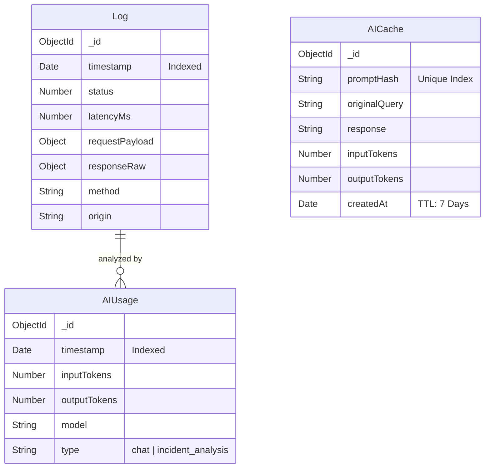

# BizScout Real-Time API Monitoring System

A premium, AI-powered observability platform designed to monitor system health, detect anomalies, and provide intelligent insights using the Gemini 1.5 Flash model.


## 🚀 Architecture Overview

The system follows a modern decoupled architecture designed for high scalability and real-time observability.

-   **Frontend**: Built with **React 18 (Vite)** and styled using a custom **Tailwind CSS** theme (BizScout branding). It uses **Server-Sent Events (SSE)** for real-time log streaming without polling.
-   **Backend**: A **Node.js/Express** server that orchestrates the monitoring service, manages the database, and integrates with Google's Generative AI.
-   **Monitoring Service**: A background **node-cron** service that executes periodic pings, captures latency/status, and persists logs.
-   **AI Layer**: Uses **Gemini 1.5 Flash** for dual-mode analysis:
    1.  **Anomaly Detection**: Automatic analysis of high-latency or failed requests.
    2.  **Interactive Assistant**: A natural language interface to query system health and logs.
-   **Database**: **MongoDB Atlas** for document-based storage of logs, persistent AI usage metrics, and specialized TTL-based caching.

---

## 🛠 Choice of Technologies & Reasoning

-   **React + Vite**: Chosen for the blistering fast development cycle and modular component architecture.
-   **Tailwind CSS**: Enables rapid, pixel-perfect UI development aligned with the **BizScout** brand identity (Muddy Yellow theme).
-   **SSE (Server-Sent Events)**: Preferred over WebSockets for real-time logs because it is more lightweight and efficient for one-way server-to-client streaming.
-   **Gemini 1.5 Flash**: Selected for its 1M+ token context window and extremely low cost ($0.075/1M input), making it ideal for processing large log volumes.
-   **MongoDB**: Provides the necessary flexibility to store varied `requestPayload` and `responseRaw` objects without strict schema overhead.

---

## 📊 Database Schema



---

## ⚙️ Setup Instructions

### Prerequisites
- Node.js 20+
- MongoDB Atlas Account
- Google Gemini API Key

### Configuration
Create a `.env` file in the `server` directory:
```env
MONGO_URI=your_mongodb_uri
GEMINI_API_KEY=your_gemini_key
PORT=3000
```

### Installation
From the root directory:
```bash
npm install
```

### Running the App
**Development Mode (Hot Reloading)**:
```bash
npm run dev
```

**Production Build**:
```bash
npm run build
npm start
```

---

## 🧪 Testing Strategy

The system prioritizes reliability through a tiered testing approach:

-   **Unit Tests (`Jest`)**: Focused on critical logic like AI cost estimation and token counting in `server/services/aiService.js`.
-   **Integration Tests (`Supertest`)**: Validates the end-to-end flow of raw logs to aggregated dashboard statistics.
-   **Coverage**: The backend maintains high coverage for controllers, services, and utility helpers.

Run tests:
```bash
cd server
npm test
```

---

## 📝 Assumptions Made

1.  **Log Retention**: The system assumes logs are valuable for long-term analysis, while AI caches are ephemeral (7-day TTL).
2.  **Network Stability**: The monitoring service assumes the target endpoint handles POST requests with JSON payloads.
3.  **Pricing**: Cost estimates are based on current Google Gemini 1.5 Flash pricing tiers.

---

## 🌟 Future Improvements

-   **Multi-Endpoint Support**: Allow users to monitor multiple external APIs simultaneously.
-   **Webhooks & Alerting**: Integrate Slack/Discord webhooks for immediate notification of detected incidents.
-   **Historic Analytics**: Implement detailed trend charts using D3.js or Chart.js.
-   **Dockerization**: Provide a `docker-compose.yml` for simplified, containerized deployment.
